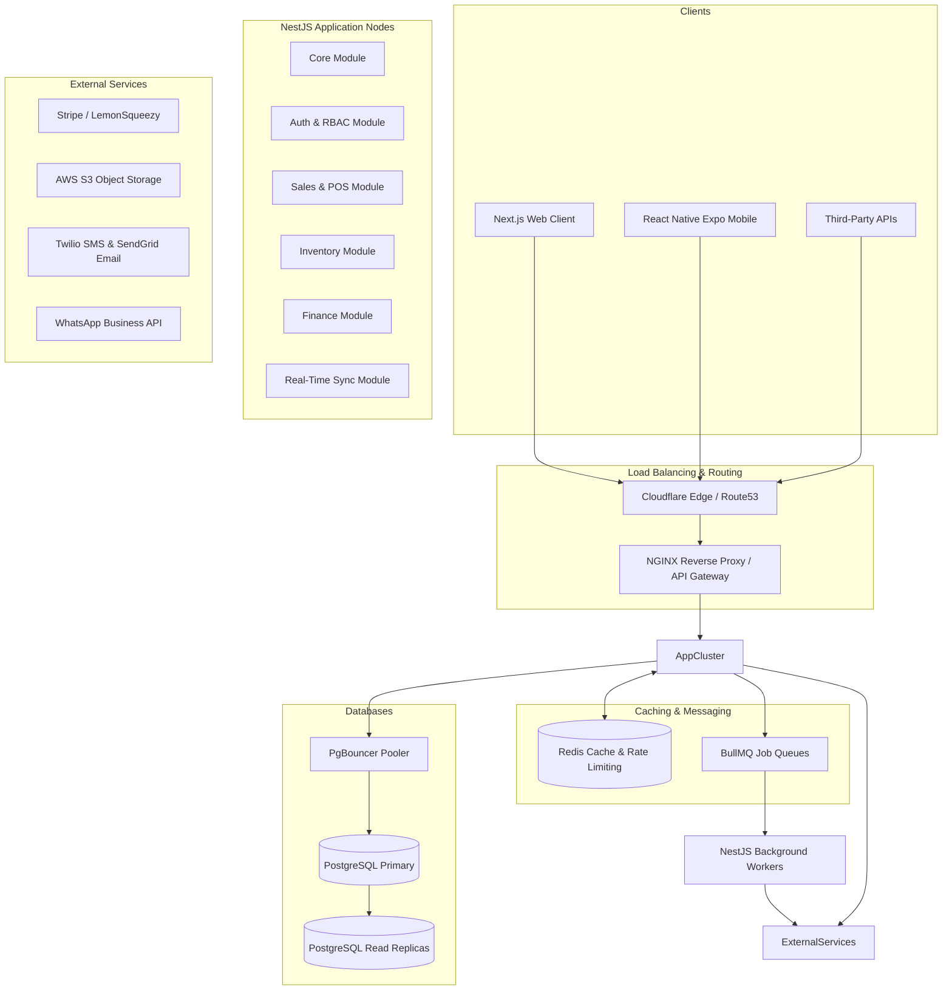

# System Architecture Blueprint

This document details the high-level system components, API boundaries, background processing engines, and real-time synchronization mechanisms. The system is designed as a **Modular Monolith** for core operations to simplify deployment and testing, transitioning to distributed microservices for heavy asynchronous components (e.g., PDF generation, reporting, billing triggers, WhatsApp integrations).

---

## 1. High-Level Architecture Diagram

The system employs a layered architecture separating clients, load balancing, API routing, application modules, messaging systems, and persistence stores:



---

## 2. Shared Backend Structure (NestJS Modules)

NestJS modules are strictly encapsulated and use events (`EventEmitter2` or Redis Pub/Sub) for inter-module communication rather than direct database imports. This ensures the modules can be extracted into individual microservices if needed as the system scales.

```
src/
├── app.module.ts              # Root configuration and module registration
├── main.ts                    # Application bootstrapping (Fastify adapter)
├── common/                    # Shared filters, interceptors, pipes, utilities
│   ├── guards/                # RBAC, JWT, and Subscription guards
│   ├── interceptors/          # Tenant Context & Audit Log interceptors
│   └── middleware/            # Rate Limiting & Tenant resolver
├── modules/
│   ├── auth/                  # JWT auth, 2FA validation, signups
│   ├── tenant/                # Tenant onboarding, settings, custom domains
│   ├── rbac/                  # Dynamic role allocation, permission mapping
│   ├── customer/              # CRM, notes, and profiles
│   ├── product/               # Categories, variant SKU generator
│   ├── inventory/             # Multiple warehouses, stock movements, alerts
│   ├── sales/                 # Quotes, sales invoices, POS processing
│   ├── finance/               # Expenses, double-entry bookkeeping ledgers
│   ├── sync/                  # Mobile synchronization engine
│   └── notification/          # Transactional notification dispatcher
```

---

## 3. Real-Time Synchronization Architecture

Real-time synchronization ensures that when a cashier completes a sale on the POS terminal, the inventory update is immediately pushed to the store manager's mobile app.

### 3.1 Socket.io with Redis Adapter
To support horizontal scaling, we deploy a stateless Socket.io gateway layer in NestJS using the `@socket.io/redis-adapter`.

```
                  ┌──────────────────────┐
                  │ Next.js Web / Mobile │
                  └──────────┬───────────┘
                             │ Websocket Connection
            ┌────────────────┴────────────────┐
            ▼                                 ▼
   ┌─────────────────┐               ┌─────────────────┐
   │ NestJS Node 1   │               │ NestJS Node 2   │
   └────────┬────────┘               └────────┬────────┘
            │                                 │
            └───────────────┬─────────────────┘
                            ▼ Redis Pub/Sub channel
                  ┌──────────────────────┐
                  │    Redis Cluster     │
                  └──────────────────────┘
```

1. **Client Connection**: When a user logs in, the client establishes a secure WebSocket connection. The backend authenticates the token and joins the socket socket connection to a specific tenant room:
   ```typescript
   socket.join(`tenant:${client.user.tenantId}`);
   ```
2. **Event Broadcast**: When an inventory change occurs, the Inventory controller publishes an event:
   ```typescript
   this.syncGateway.server.to(`tenant:${tenantId}`).emit('inventory:updated', { productId, newStock });
   ```
3. **Redis Sync**: If the client is connected to `NestJS Node 2` but the event was triggered on `NestJS Node 1`, the Redis Pub/Sub adapter replicates the message to Node 2 to deliver it to the user's client.

---

## 4. Event-Driven Background Processing (BullMQ)

Heavy operations are processed out-of-band by a cluster of background worker instances. We use **BullMQ** on top of Redis for robust job queuing, retries, and rate limiting.

### 4.1 Queue Configurations
* **`notification-queue`**: Handles outbound emails, SMS notifications, and WhatsApp updates.
* **`invoice-pdf-queue`**: Generates invoice PDFs asynchronously via headless Chromium and uploads them to S3.
* **`sync-reconciliation-queue`**: Reconciles conflicts submitted by mobile devices operating offline.
* **`ledger-posting-queue`**: Posts transactions asynchronously to double-entry general ledgers.

### 4.2 Queue Worker Snippet
```typescript
import { Processor, WorkerHost } from '@nestjs/bullmq';
import { Job } from 'bullmq';

@Processor('notification-queue')
export class NotificationProcessor extends WorkerHost {
  async process(job: Job<any, any, string>): Promise<any> {
    switch (job.name) {
      case 'send-whatsapp-receipt':
        await this.whatsappService.sendTemplateMessage(
          job.data.phone,
          'pos_receipt',
          job.data.parameters
        );
        break;
      case 'send-low-stock-alert':
        await this.emailService.sendEmail(
          job.data.managerEmail,
          'Low Stock Alert',
          'low-stock-alert-template',
          job.data.items
        );
        break;
    }
  }
}
```

### 4.3 Reliability & Retry Strategies
* **Exponential Backoff**: Jobs that fail due to external API timeouts (e.g., WhatsApp gateway offline) are configured with exponential backoff retries:
  ```json
  {
    "attempts": 5,
    "backoff": {
      "type": "exponential",
      "delay": 5000
    }
  }
  ```
* **Dead Letter Queues (DLQ)**: Failing after 5 retries moves the job into a failed registry where alerts are triggered to the DevOps engineering team via Sentry.
