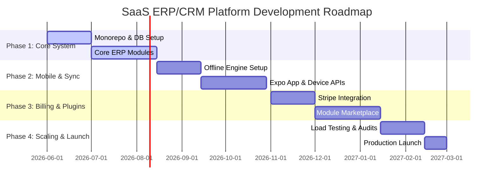

# Product Roadmap & Sprint Delivery Plan

This document details the high-level roadmap, resource allocations, sprint timelines, and release milestones for building and delivering the platform.

---

## 1. Commercial Roadmap (Phases 1-4)

The project timeline is structured into four major commercial milestones:

### Phase Descriptions
* **Phase 1: Foundation & Core ERP (Month 1-3)**:
  Establish database cluster, PNPM Monorepo structure, NestJS API gateway, basic RBAC, and core web dashboards. Deliver: Products, Warehouses, Customers, and Invoicing web modules.
* **Phase 2: Mobile Offline-First Experience (Month 4-5)**:
  Build React Native mobile application using Expo. Integrate local SQLite database using WatermelonDB. Implement timestamp synchronization protocol and barcode scanning.
* **Phase 3: Billing Engine & Module Marketplace (Month 6-7)**:
  Configure Stripe plans and billing portal webhooks. Build module marketplace management capabilities, dynamic route guards, and dynamic UI loading.
* **Phase 4: Optimization, Security Audits & Launch (Month 8)**:
  Execute load tests (simulating 10k active POS terminals), run external OWASP vulnerability pen-tests, establish backup recovery routes, and initiate production deployment checklist.

---

## 2. 6-Sprint Implementation Plan

Each sprint represents a 2-week block of development, followed by verification.

### Sprint 1: Setup, Auth, & Multi-Tenant Core
* **Tasks**:
  - Configure monorepo structure (apps/api, apps/web, packages/database, packages/dto).
  - Deploy PostgreSQL database schema, configure Row-Level Security (RLS) rules.
  - Implement NestJS tenant extraction middleware and Prisma transaction interceptor.
  - Build Auth module: Sign-up, Sign-in, JWT token management, HTTPOnly sliding refresh cookies.
* **Milestone**: Multi-Tenant auth flow verified; API returns 401 on incorrect tenant contexts.

### Sprint 2: Core Inventory & Warehouses
* **Tasks**:
  - Implement Product variant generator engine supporting attributes JSONB indexing.
  - Build Multi-Warehouse registry endpoints: Create, Update, List.
  - Create stock movement logging system tracking purchase entries and manual stock adjustments.
  - Build dynamic Low Stock scheduled alerting engine using BullMQ.
* **Milestone**: Products created web-side successfully update warehouse inventory balances.

### Sprint 3: Sales, Invoices & POS
* **Tasks**:
  - Create Invoice compiler engine calculating subtotal, taxes, discounts, and total.
  - Implement POS cash register session controller (Open session, Add payments, Close session).
  - Build high-speed cash receipt REST endpoint (optimized for < 50ms processing).
  - Integrate PDF invoice compiler via Puppeteer serverless workers.
* **Milestone**: Cashier user completes check-out, deducts stock, updates general ledger.

### Sprint 4: Mobile Core & Offline SQLite Setup
* **Tasks**:
  - Scaffold React Native Expo application inside `apps/mobile`.
  - Implement WatermelonDB schema matching core tables, database adapter initialization.
  - Build login screen, sync dashboard stats cache to local sqlite database.
  - Create offline queue storing local invoices when network drops.
* **Milestone**: App logs in, downloads initial sync catalog, and operates offline.

### Sprint 5: Synchronization Protocols & Hardware bindings
* **Tasks**:
  - Deploy `/v1/sync/pull` and `/v1/sync/push` endpoints on the backend API.
  - Implement WatermelonDB conflict resolution triggers ("Server-Wins" for sales).
  - Bind Camera permissions and build Expo camera scanner component.
  - Integrate direct-to-S3 image uploads using pre-signed upload URL requests.
* **Milestone**: Offline POS orders auto-sync to backend, adjusting primary DB levels.

### Sprint 6: Stripe Billing & Marketplace Controls
* **Tasks**:
  - Integrate Stripe webhooks (checkout completed, subscription updated).
  - Implement NestJS module gating guards (`ModuleEnabledGuard`, `MaxProductsGuard`).
  - Render dynamically configurable web marketplace dashboard to turn modules on/off.
  - Complete integration testing: register new business, select plan, test feature blocks.
* **Milestone**: Standard tier tenants blocked from creating more than 500 products.

---

## 3. Resource Allocation Matrix

Resource planning assumes an elite cross-functional agile development squad:

| Role | Capacity | Core Responsibilities |
| :--- | :--- | :--- |
| **Solution Architect** | 100% | Oversees RLS policies, monorepo configurations, sync protocol edge cases. |
| **Backend Engineer (x2)** | 100% | NestJS modules, database indexes, BullMQ jobs, Stripe webhooks. |
| **Frontend Engineer (x2)** | 100% | Next.js dashboard pages, shacdn components, LTR/RTL logical styles. |
| **Mobile Engineer** | 100% | React Native Expo app, WatermelonDB SQLite layer, hardware integrations. |
| **DevOps Engineer** | 50% | AWS EKS clusters, CI/CD pipelines, backups, PgBouncer configurations. |
| **QA Engineer** | 100% | API integration tests, offline-recovery tests, cross-browser styling checks. |
| **Product Manager** | 50% | Sprint backlogs, stakeholder alignment, compliance verification. |
