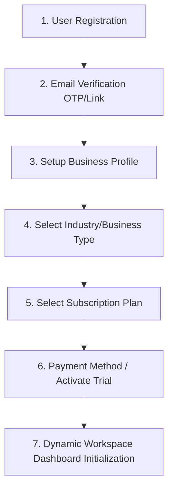
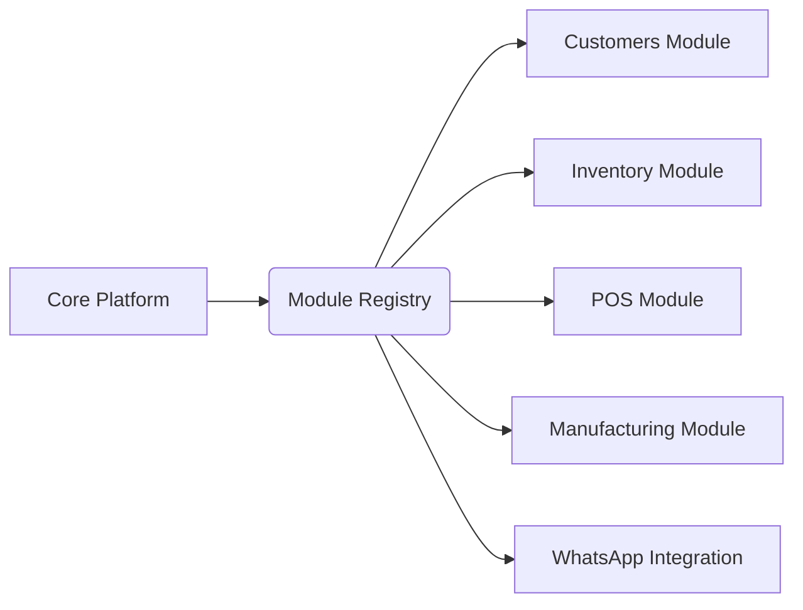

# Product Requirements Document (PRD) — Multi-Tenant SaaS ERP/CRM Platform

## 1. Product Vision & Scope

The SaaS ERP/CRM Platform is an enterprise-grade, multi-tenant solution designed to serve as the operational operating system for a wide range of Small and Medium Businesses (SMBs) and mid-market enterprises across diverse industries (e.g., retail, tailoring, garages, warehouses, restaurants, pharmacies, trading, and light manufacturing). 

The platform supports a dual-channel interface: a feature-rich, desktop-optimized Web Application (built with Next.js) and a fast, offline-capable Mobile Application (built with React Native). Both channels communicate with a shared, high-throughput backend (built with NestJS) via real-time WebSockets and highly optimized REST/GraphQL APIs, ensuring instant data synchronization.

### Target Verticals
* **Retail & Trading**: Furniture stores, electrical outlets, pharmacies, trading companies.
* **Services**: Garages, tailoring shops, construction/project-based firms, maintenance providers.
* **Hospitality**: Restaurants, cafes.
* **Logistics & Supply Chain**: Warehouses, distributors.
* **Manufacturing**: Assembly workshops, recipe-based manufacturers.

---

## 2. Tenant Lifecycle & Onboarding Flow

To ensure high-conversion self-service onboarding, the registration flow is structured into a streamlined, multi-step wizard:

### Detailed Onboarding Steps

1. **Register Account**:
   - Fields: Full Name, Email, Password (enforced: 12+ characters, upper/lower, symbol, number), Phone Number.
   - Action: User record created in the system database (global schema). Tenant association is not yet established.
2. **Verify Email**:
   - Action: Verification token sent via transactional email (SendGrid/Amazon SES). User enters OTP or clicks verification link.
3. **Create Business**:
   - Fields: Business Name, Phone Number, Registration/VAT Number, Currency, Timezone, Language (English/Arabic).
   - Action: A new Tenant record is created. The user is designated as the Tenant Owner.
4. **Select Business Type**:
   - Options: *Retail/Trading, Tailoring Shop, Garage, Warehouse, Restaurant, Pharmacy, Construction, Service, Manufacturing*.
   - Action: System presets default settings, metadata configurations, and pre-selects relevant modules in the module registry.
5. **Select Subscription Plan**:
   - Tiers: *Starter, Business, Professional, Enterprise*.
6. **Activate Trial**:
   - Action: Stripe/LemonSqueezy customer subscription is created in "trialing" state. Generates a 14-day trial period without requiring immediate payment details for lower plans, or requires card for premium plans.
7. **Enter Dashboard**:
   - Action: The UI initializes and dynamically registers the modules based on the selected business type. The user is redirected to the home dashboard.

---

## 3. Module Marketplace Design

The platform uses a modular architecture where features are decoupled from the core platform and treated as plugins. This keeps the application performant for small businesses that only need a subset of features while supporting growth into complex ERP needs.

### Module Catalog
The platform classifies its modules into three categories:

| Module Name | Tier Access | Description | Dependencies |
| :--- | :--- | :--- | :--- |
| **Customers (CRM)** | All Tiers | Profiles, lifecycle tracking, notes, interaction logs. | None |
| **Products & Inventory** | Starter + | Category/brand registry, multi-warehouse, stock transfers. | None |
| **Sales & Invoices** | Starter + | Quotes, sales orders, invoices, credit notes, POS integrations. | Customers, Inventory |
| **Purchases & Suppliers** | Business + | Purchase orders, suppliers registry, receipt matching. | Inventory |
| **Finance & Cash Flow** | Business + | Expense tracking, receipts, income statements, tax reporting. | Sales, Purchases |
| **HR & Payroll** | Professional + | Employee files, check-in, payroll generation, bank sheets. | None |
| **Projects & Tasks** | Professional + | Gantt timelines, milestone tracking, timesheets, tasks. | Customers |
| **Manufacturing** | Enterprise | Bill of Materials (BOM), work orders, waste tracking. | Inventory |
| **WhatsApp Sync** | Enterprise / Add-on | Automated order notifications, receipts, PDF sharing. | Sales, Customers |

### Enable/Disable & Licensing Mechanism
* **Dynamic Routing Guards**: API requests to disabled modules reject with `403 Module Disabled`.
* **Dynamic UI Rendering**: Frontend fetches `/api/v1/tenant/modules` on boot and dynamically filters navigation links, route bundles, and state containers.
* **Granular RBAC Integration**: Permissions are scoped by modules. Enabling a module unlocks its respective permissions inside the RBAC manager.

---

## 4. Core Functional Modules

### 4.1 Customer Management (CRM)
* **Customer Profile**: Central repository containing client name, contact metadata, tax registration number, credit limits, and billing/shipping addresses.
* **Customer History**: Chronological view of sales orders, invoice receipts, quotations, and returns.
* **Interactions & Notes**: Rich-text timeline for sales calls, system notes, and attached documents (PDF contracts, image attachments).
* **Payment Tracking**: Record of customer account balance, outstanding invoices, payments received, and credit limits.

### 4.2 Product Management
* **Hierarchical Categorization**: Unlimited depth category trees and brands taxonomy.
* **Variant System**: Multi-attribute variants (e.g., Size, Color, Material). System generates unique SKUs and barcodes for each combination.
* **Image Assets**: Integration with AWS S3 for uploading, resizing, and serving product gallery images.
* **Stock Configuration**: Define min/max stock thresholds, reorder points, tax rates (VAT/GST/Sales Tax), and unit-of-measure (UOM) configurations.

### 4.3 Inventory & Warehouse Management
* **Multi-Warehouse Support**: Trace inventory balances separately across multiple physical locations or retail shelves.
* **Stock Movements**: Track all stock changes (e.g., Purchase Receipt, Sales Invoice, Damaged Stock Write-off, Stock Count Adjustment).
* **Stock Transfers**: Multi-step warehouse transfer system (Initiated -> In-Transit -> Received) with audit trails.
* **Low Stock Alerts**: Scheduled cron jobs scan inventory levels against reorder points and dispatch in-app notifications and email summaries.

### 4.4 Sales & Invoicing
* **Quotations**: Draft pricing proposals sent via email/WhatsApp. Conversion mechanism: `Quotation -> Sales Order -> Invoice`.
* **Invoices**: Tax-compliant invoices with QR codes (e.g., ZATCA compliance in Saudi Arabia).
* **Returns & Credit Notes**: Return workflows validating items against original invoices to prevent fraudulent returns.
* **POS Interface**: High-speed cashier checkout screen supporting barcode scanner, cash register, card terminal, and immediate invoice printing.

### 4.5 Purchases & Supplier Management
* **Supplier Profiles**: Directory containing payment terms, billing currency, contact info, and tax registries.
* **Purchase Orders (PO)**: Automated generation of PO documents based on low stock alerts. Email delivery directly to suppliers.
* **Purchase Invoices & GRN**: Goods Received Notes (GRN) matching invoices against POs to identify quantity/pricing mismatches.

### 4.6 Finance, Accounting & Cash Flow
* **Chart of Accounts (COA)**: Standard financial ledger structure customized automatically by industry.
* **Expense Management**: Multi-currency expense logs with receipt uploads (S3 bucket storage) and tax category classifications.
* **Double-Entry Bookkeeping**: Automated creation of general journal entries on Sales, Purchases, Payments, and Depreciation.
* **Financial Statements**: Dynamic generation of Profit & Loss (P&L), Balance Sheet, and Trial Balance.

---

## 5. Non-Functional Requirements

### 5.1 Dynamic Dashboards
* **Dashboard Customization**: Users can drag, drop, resize, and remove dashboard widgets. Configuration is stored in database JSON columns (`tenant_dashboards` table).
* **Pre-Built Widgets**: Sales Today, Revenue Graph, Expense Analysis, Low Stock alerts, Top-Selling Products (Pie chart), Recent Invoices.

### 5.2 Localization (RTL / LTR)
* **Bilingual Support**: Full Arabic (RTL) and English (LTR) localizations.
* **Direction Handling**: Next.js App Router utilizes the `lang` and `dir="rtl|ltr"` attributes on the root HTML element. CSS properties rely on CSS Logical Properties (e.g., `margin-inline-start`, `padding-inline-end`).
* **Locale Persistence**: User language preferences are stored in the user profile table, sync'd with local storage on web/mobile apps.

### 5.3 Performance & High-Availability
* **API Response Time**: 95% of read requests must return within < 150ms.
* **System Uptime**: 99.9% monthly service availability, backed by multi-zone database replication.
* **Database Partitioning**: Tables containing historical transaction lines (e.g., `invoice_items`, `stock_movements`, `audit_logs`) are partitioned monthly by timestamp.
